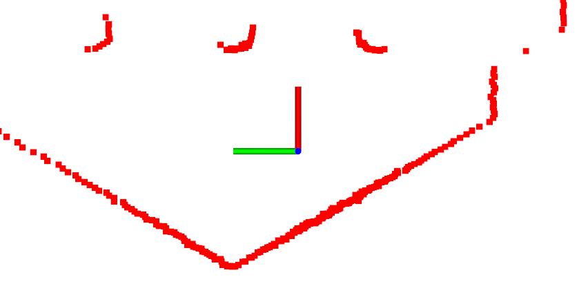
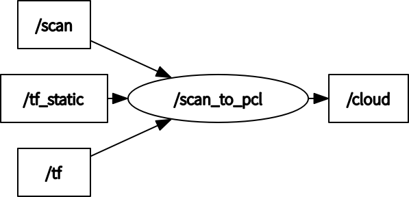

# scan_to_pcl_ros


[](https://opensource.org/licenses/BSD-3-Clause)

ROS package for converting scan to pcl

<p align="center">
  
</p>

## Environment
- Ubuntu 20.04
- ROS Noetic
- PCL

## Dependency
- [laser_geometry](http://wiki.ros.org/laser_geometry)

## Install and Build
```
# clone repository
cd /path/to/your/catkin_ws/src
git clone https://github.com/ToshikiNakamura0412/scan_to_pcl_ros.git

# build
cd /path/to/your/catkin_ws
rosdep install -riy --from-paths src --rosdistro noetic # Install dependencies
catkin build scan_to_pcl_ros -DCMAKE_BUILD_TYPE=Release # Release build is recommended
```

## How to use
```
roslaunch scan_to_pcl_ros scan_to_pcl.launch
```

## Running the demo
```
# clone repository
cd /path/to/your/catkin_ws/src
git clone -b noetic-devel https://github.com/ROBOTIS-GIT/turtlebot3_msgs.git
git clone -b noetic-devel https://github.com/ROBOTIS-GIT/turtlebot3.git
git clone -b noetic-devel https://github.com/ROBOTIS-GIT/turtlebot3_simulations.git

# build
cd /path/to/your/catkin_ws
rosdep install -riy --from-paths src --rosdistro noetic
catkin build -DCMAKE_BUILD_TYPE=Release

# run demo
export TURTLEBOT3_MODEL=burger
roslaunch scan_to_pcl_ros test.launch
```

## Node I/O


### Runtime requirement
TF (from the frame_id of scan to the frame_id of pcl) is required

## Nodes
### scan_to_pcl
#### Published Topics
- /cloud (`sensor_msgs/PointCloud2`)
  - The converted point cloud

#### Subscribed Topics
- /scan (`sensor_msgs/LaserScan`)
  - The input scan data

#### Parameters
- ~\<name>/<b>frame_id</b> (string, default: `base_scan`):<br>
  The frame id of converted point cloud

## References
- https://github.com/ros-perception/pointcloud_to_laserscan
